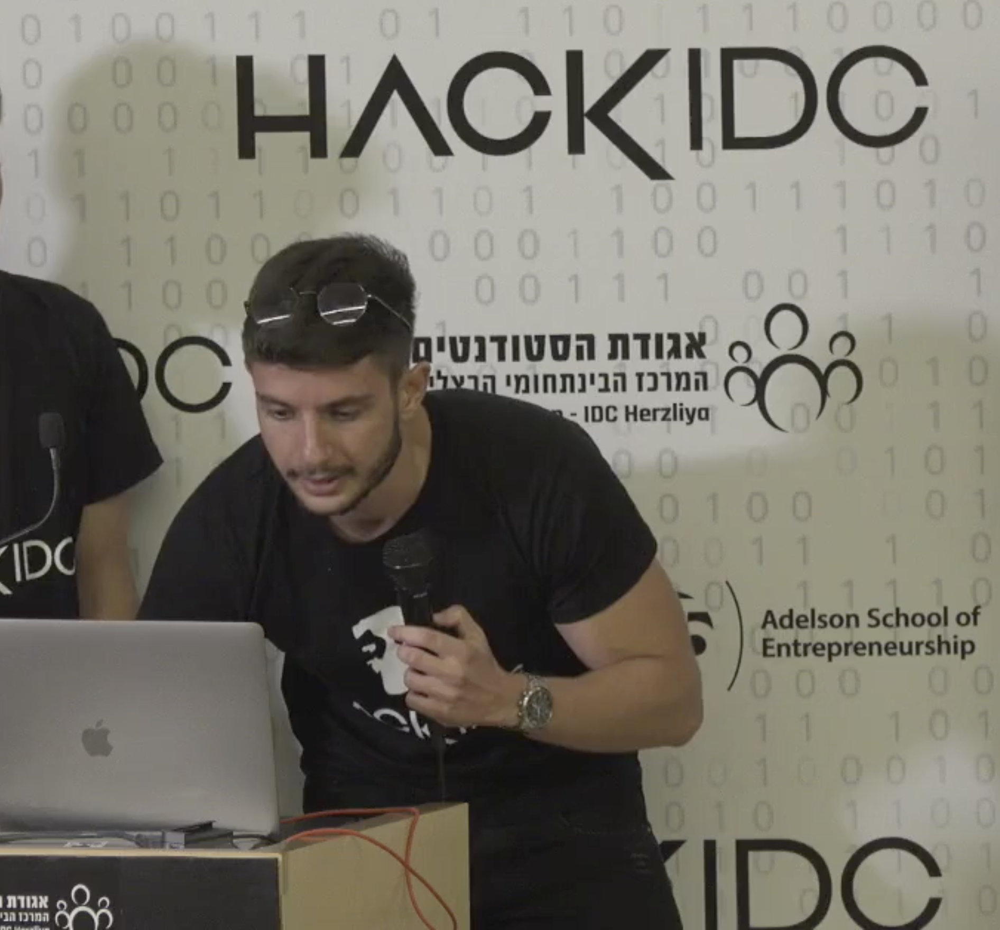
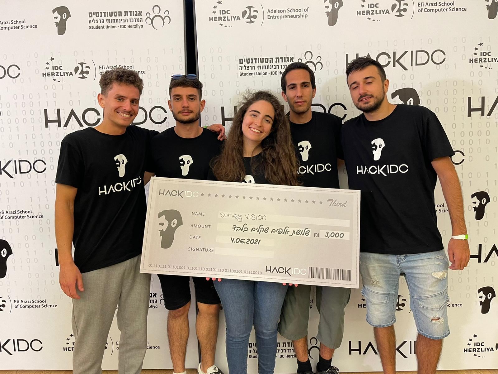

היי, שמי רועי אמויאל, בן 23, סטודנט <b>למדעי המחשב בהתמחות במדעי הנתונים</b> באוניברסיטת בן גוריון בנגב. את הלימודים התחלתי תוך כדי השירות הצבאי בחיל האוויר, באוניברסיטה הפתוחה. לאחר שהשתחררתי, סיימתי את רוב השנה הראשונה של הלימודים באוניברסיטה הפתוחה בממוצע 91 והמשכתי את לימודיי באוניברסיטת בן גוריון.
  

  

לעולם הראייה הממוחשבת נחשפתי לראשונה כשהשתתפתי 
<b>בהאקתון הסטודנטים הגדול בארץ</b> 
(HackIDC 2021).
היה לי רעיון טוב אך מעט מאוד ידע בנושא. לאחר שבדקתי מה האפשרויות שיש לי, נחשפתי לעולם מדהים, ומצאתי את הכלי שהייתי צריך. 
Feature Matching למתעניינים.
מאז אני ללא הפסקה במקביל ללימודים, חוקר, לומד ומפתח פרויקטים בנושא.
הצלחתי להתקבל לתוכנית התמחות
Starship,
תוכנית העוסקת בשיתוף פעולה בין פאק הייטק גב-ים לבין אוניברסיטת בן גוריון,
ונותנת אפשרות להתמחת בחברות במהלך הסמסטר לסטודנטים שעוברים את הראיונות.
הצלחתי לעבור את כל הראיונות בכל החברות שבחרתי, בין היתר להיות סטודנט במחקר ב
NLP,
אך לקחתי סיכון, ובחרתי בחברה בה ציינו שיכול להיות שיהיה פרויקט עם 
Image Processing
ואכן כך היה. 
בנוסף לכל זה, בזכות ההתעניינות הרבה שלי בנושא, קיבלתי כרטיס מטעם 
General Motors
לכנס 
IMVC 2021 
בו נחשפתי לחברות ולסטארטפים העוסקים בנושא, ארכיקטטורות שונות ב
Deep Learning 
וב-
Computer Vision 
והרעב שלי לעולם הראייה הממוחשבת רק גדל. 
תוכלו למצוא מידע נוסף על הפרויקטים שלי בגיטאהב ובקורות חיים
  
אז מה התכנונים לעתיד?  
אני מתכנן להמשיך לתואר שני בנושא, מאוד הייתי רוצה להיות חוקר בתחום אם זה באקדמיה ובתעשייה.  
 

ולסיום אם תהיתם, הקבוצה שלי בהאקתון, כולנו חסרי ניסיון בכל תחום הקשור לעולם הייטק, ניצחנו
 <b>במקום השלישי</b>
 , 
 מתוך 60+ קבוצות ו300+ משתתפים מרחבי כל האוניברסיטאות כמו הטכניון ,העברית ות״א, חלקם במהלך התואר השני וחלקם סטודנטים העובדים בתעשייה.
  

