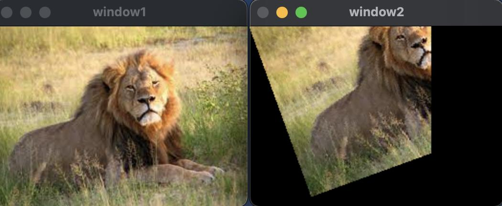
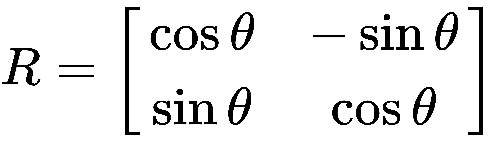
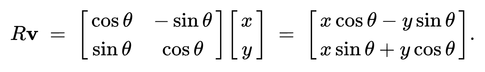
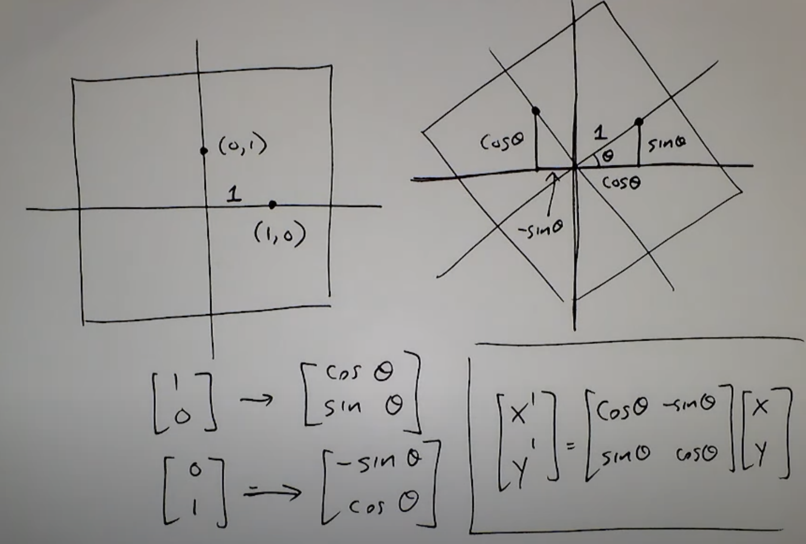
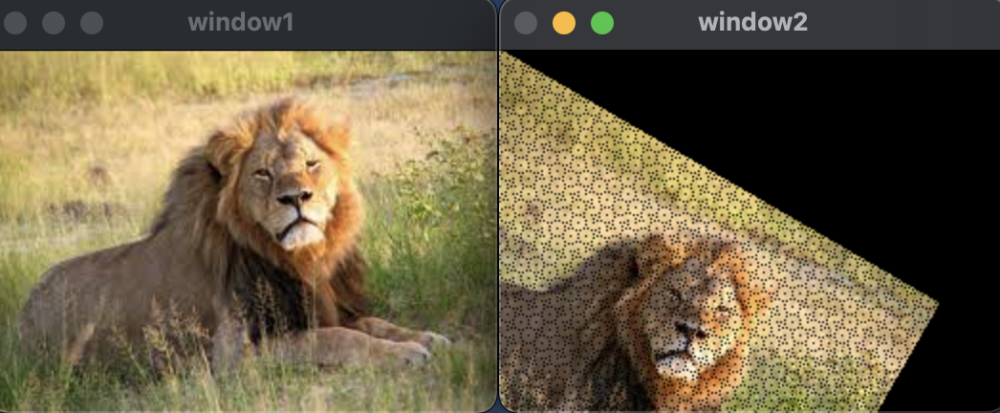

   <h1 align=center>Affine Transformations</h1>
  <h2> Image Rotation </h2> 
    אז בחלק הזה נלמד איך לעשות רוטציות לתמונה. ראשית אציג את הדרך הנאיבית בה היווצרו חורים בתמונה (בשל הזזת הפיקסלים) ולאחר מכן נפתור את הבעייה באמצעות שימוש באינטרפולציה שעליה פירטתי בהרחבה בפוסט הבא <a href="index.md">interpolation</a>.   
    <b>בחלק הבונוס:</b>
    נלמד איך לבצע את הרוטציה ע״י שינוי ראשית הצירים לבמרכז התמונה מראשית הצירים המקורית של התמונה הנמצאת בפינה השמאלית העליונה של התמונה.
  
      
 <figure>
    
    <figcaption> רוטציה  </figcaption>
</figure>
  
  <h3> תאוריה </h3>
   כשמבצעים רוטציה לתמונה מבצעים את הרוטציה בזווית &alpha; שבדרך מתקבלת כפרמטר מהמשתמש.  
   לדגומה בתמונה הבאה, אנחנו מבצעים רוטציה בזווית &alpha; מהפיקסל (u,v) אל הפיקסל (x,v).

   
         
   
   כעת עלינו להכיר כמה כלים מתמטיים שישמשו אותנו עבור ביצוע הרוטציה. 
   
מטריצת הרוטציה (ככל הנראה נתקלתם באזכור שלה באחד מקורסי הלינארית): 
   

   
  
  
   
   באופן כללי עבור הזזת הפיקסל 
   (x,y):
 
   
   
   

     
    <b> לכאורה </b> 
  במבט ראשון הכלי נראה 
   מושלם לביצוע הרוטציה שאנחנו צריכים עבור התמונה. בואו ננסה להשתמש בה. 
     
    

<b> ראשית נייבא את הספריות הדרושות לנו: </b>


#include <iostream>
#include <cmath>
#include "opencv2/opencv.hpp"


 

<b>
לאחר מכן נכתוב את התוכנית המרכזית להצגת התמונות: (אם משהו לא מובן בחלק זה, נא לקרוא את
  <a href="https://royamoyal.github.io/ComputerVision-ImageProcessing-Tutorial-Blog/Basics.html">המדריך הבסיסי לבלוג</a>
)
</b>

 
 

int main() {
    cv::Mat img = cv::imread("../lion.jpeg");
    
    cv::Mat rotatedImage(img.rows,img.cols,CV_8UC3);

    // Rotating
    NaiveRotation(img,rotatedImage,30);
    // End of Rotating

    // Show the images
    cv::imshow("window1",img);
    cv::imshow("window2",rotatedImage);
    cv::waitKey(0);
    // End of Show the images

    return 0;
}


 

וכעת נתבונן בפונקציית הרוטציה הנאיבית שלנו:

 

   void NaiveRotation(cv::Mat src, cv::Mat dst, int angle) {
    double rotatedX;
    double rotatedY;

    double toRadian = 3.141592653589 / 180;

    // ---------------------------- RGB HANDLER ----------------------------
    for (int x = 0; x < src.cols; x++) {
        for (int y = 0; y < src.rows; y++) {

            rotatedX = round(x * cos(angle * toRadian) - y * sin(angle * toRadian));
            rotatedY = round(x * sin(angle * toRadian) + y * cos(angle * toRadian));

            cv::Point2i dstPixel((int) rotatedX, (int) rotatedY);

            // Checking if the Interpolation calculations crossed the boundaries
            if (dstPixel.x < 0 || dstPixel.x > src.cols - 1 || dstPixel.y < 0 || dstPixel.y > src.rows - 1)
                dst.at<cv::Vec3b>(cv::Point(x, y)) = 0;
            else { // In case everything is good
                dst.at<cv::Vec3b>(dstPixel) = src.at<cv::Vec3b>(cv::Point(x, y));
            }
        }
    }
}


 

<b> וזו התוצאה שנקבל:<b>
 
  

כמו שניתן לראות, אמנם הצלחנו לבצע את הרוטציה אבל אך לא הצלחנו לשמר את איכות התמונה ולמעשה נוצרו חורים בין הפיקסלים.
בעיה זו נקראת Aliasing.
 
 

<h4> :הסבר לקוד </h4>

rotatedX = round(x * cos(angle * toRadian) - y * sin(angle * toRadian));
rotatedY = round(x * sin(angle * toRadian) + y * cos(angle * toRadian));
cv::Point2i dstPixel((int) rotatedX, (int) rotatedY);



למעשה באמצעות לולאה מקוננת נעבור על כל פיקסל בתמונה ונחשב לאן היא אמורה לעבור לתמונת יעד שלנו.
 
<ol>
הערות:
  <li>.כמו בחישוב במחשבון, נצטרך להעביר את הזווית שהמשתמש הכניס לרדיאנים</li>
  <li>מכיוון שפיקסלים מיוצגים במחשב ע״ מספרים טבעיים והחישוב שלנו עלול לתת ערכים חיוביים שאינם שלמים, נצטרך לעגל לערך הקרוב ביותר כדי לבחור את הפיקסל המתאים. (מתקשר לבעיית ה
  aliasing.</li>
</ol>


if (dstPixel.x < 0 || dstPixel.x > src.cols - 1 || dstPixel.y < 0 || dstPixel.y > src.rows - 1)
                dst.at<cv::Vec3b>(cv::Point(x, y)) = 0;
            else { // In case everything is good
                dst.at<cv::Vec3b>(dstPixel) = src.at<cv::Vec3b>(cv::Point(x, y));


מכיוון שאנו מזיזים את התמונה, ישנם פיקסלים שערך הפיקסל החדש בתמונה היעד, יצא למעשה מגבולות התמונה, כלומר באופן מעשי הוא אמור להיעלם.
בפועל באופן דיפולטיבי ב
OpenCV 
, ברגע שמנסים להזין ערך לפיקסל מחצה את גבולות התמונה, למעשה הערך יוזן לפיקסל שנמצא בגבולות התמונה אליו נגיע באופן מעגלי מתחילת אותה העמודה או השורה אותה חצינו.
 
לדוגמה:

<h4>Aliasing</h4>

   הדרך הנאיבית:
   הדרך הנאיבית, נשלח כל פיקסל באמצעות הטרנספורמציה שהדגמנו קודםם.
   
   
   
  
   
   
    
לפי טריגונומטריה 
   
 

   
   
   

   
   
   
