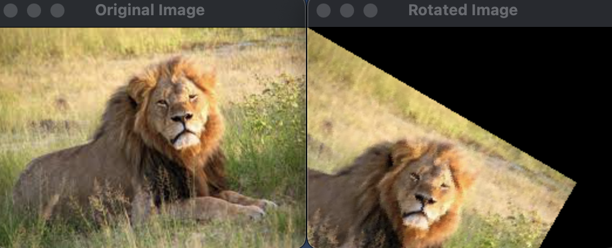
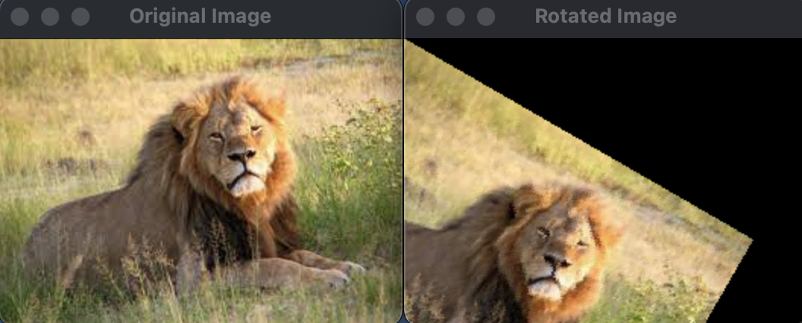

<head>

</head>

   <h1 align=center>Affine Transformations</h1>
  <h2> Image Rotation </h2> 
    אז בחלק הזה נלמד איך לעשות רוטציות לתמונה. ראשית אציג את הדרך הנאיבית בה היווצרו חורים בתמונה (בשל הזזת הפיקסלים) ולאחר מכן נפתור את הבעייה באמצעות שימוש באינטרפולציה שעליה פירטתי בהרחבה בפוסט הבא <a href="index.md">interpolation</a>.   
    <b>בחלק הבונוס:</b>
    נלמד איך לבצע את הרוטציה ע״י ממרכז התמונה על ידי שינוי ראשית הצירים שבדיפולט נמצאת בפינה השמאלית העליונה של התמונה.
      
 <figure>
    
    <figcaption> רוטציה  </figcaption>
</figure>
  
  <h3> תאוריה </h3>
   כשמבצעים רוטציה לתמונה מבצעים את הרוטציה בזווית &alpha; שבדרך מתקבלת כפרמטר מהמשתמש.  
   לדגומה בתמונה הבאה, אנחנו מבצעים רוטציה בזווית &alpha; מהפיקסל (u,v) אל הפיקסל (x,v).

   
         
   
   כעת עלינו להכיר כמה כלים מתמטיים שישמשו אותנו עבור ביצוע הרוטציה. 
   
מטריצת הרוטציה (ככל הנראה נתקלתם באזכור שלה באחד מקורסי הלינארית): 
   

   
  
  
   
   באופן כללי עבור הזזת הפיקסל 
   (x,y):
 
   
   
   

     
    <b> לכאורה </b> 
  במבט ראשון הכלי נראה 
   מושלם לביצוע הרוטציה שאנחנו צריכים עבור התמונה. בואו ננסה להשתמש בה. 
    
   <b>הערה:</b>
   בקוד הבא ביצענו רוטציה אך ורק לתמונות עם צבע, כאמור 
   BGR.
   בהמשך נדאג גם לבצע את הרוטציה לתמונות 
   Grayscale
    
    

    

<b> ראשית נייבא את הספריות הדרושות לנו: </b>


#include <iostream>
#include <cmath>
#include "opencv2/opencv.hpp"


 

<b>
לאחר מכן נכתוב את התוכנית המרכזית להצגת התמונות: (אם משהו לא מובן בחלק זה, נא לקרוא את
  <a href="https://royamoyal.github.io/ComputerVision-ImageProcessing-Tutorial-Blog/Basics.html">המדריך הבסיסי לבלוג</a>
)
</b>

 
 

int main() {
    cv::Mat img = cv::imread("../lion.jpeg");
    
    cv::Mat rotatedImage(img.rows,img.cols,CV_8UC3);

    // Rotating
    NaiveRotation(img,rotatedImage,30);
    // End of Rotating

    // Show the images
    cv::imshow("window1",img);
    cv::imshow("window2",rotatedImage);
    cv::waitKey(0);
    // End of Show the images

    return 0;
}


 

וכעת נתבונן בפונקציית הרוטציה הנאיבית שלנו:

 

   void NaiveRotation(cv::Mat src, cv::Mat dst, int angle) {
    double rotatedX;
    double rotatedY;

    double toRadian = 3.141592653589 / 180;

    // ---------------------------- RGB HANDLER ----------------------------
    for (int x = 0; x < src.cols; x++) {
        for (int y = 0; y < src.rows; y++) {

            rotatedX = round(x * cos(angle * toRadian) - y * sin(angle * toRadian));
            rotatedY = round(x * sin(angle * toRadian) + y * cos(angle * toRadian));

            cv::Point2i dstPixel((int) rotatedX, (int) rotatedY);

            // Checking if the Interpolation calculations crossed the boundaries
            if (dstPixel.x < 0 || dstPixel.x > src.cols - 1 || dstPixel.y < 0 || dstPixel.y > src.rows - 1)
                dst.at<cv::Vec3b>(cv::Point(x, y)) = 0;
            else { // In case everything is good
                dst.at<cv::Vec3b>(dstPixel) = src.at<cv::Vec3b>(cv::Point(x, y));
            }
        }
    }
}


 
<b> וזו התוצאה שנקבל:</b>
 
  
 
<b>
כמו שניתן לראות, אמנם הצלחנו לבצע את הרוטציה אבל אך לא הצלחנו לשמר את איכות התמונה ולמעשה נוצרו חורים בין הפיקסלים.
בעיה זו נקראת Aliasing.
</b>
 
 

<h4> הסבר לקוד: </h4>


rotatedX = round(x * cos(angle * toRadian) - y * sin(angle * toRadian));
rotatedY = round(x * sin(angle * toRadian) + y * cos(angle * toRadian));
cv::Point2i dstPixel((int) rotatedX, (int) rotatedY);



למעשה באמצעות לולאה מקוננת נעבור על כל פיקסל בתמונה ונחשב לאן היא אמורה לעבור לתמונת יעד שלנו.
 
הערות:
<ol>
  <li>.כמו בחישוב במחשבון, נצטרך להעביר את הזווית שהמשתמש הכניס לרדיאנים</li>
  <li>מכיוון שפיקסלים מיוצגים במחשב ע״ מספרים טבעיים והחישוב שלנו עלול לתת ערכים חיוביים שאינם שלמים, נצטרך לעגל לערך הקרוב ביותר כדי לבחור את הפיקסל המתאים. (מתקשר לבעיית ה
  aliasing.</li>
</ol>


if (dstPixel.x < 0 || dstPixel.x > src.cols - 1 || dstPixel.y < 0 || dstPixel.y > src.rows - 1)
                dst.at<cv::Vec3b>(cv::Point(x, y)) = 0;
            else { // In case everything is good
                dst.at<cv::Vec3b>(dstPixel) = src.at<cv::Vec3b>(cv::Point(x, y));


מכיוון שאנו מזיזים את התמונה, ישנם פיקסלים שערך הפיקסל החדש בתמונה היעד, יצא למעשה מגבולות התמונה, כלומר באופן מעשי הוא אמור להיעלם.
בפועל באופן דיפולטיבי ב
OpenCV 
, ברגע שמנסים להזין ערך לפיקסל מחצה את גבולות התמונה, למעשה הערך יוזן לפיקסל שנמצא בגבולות התמונה אליו נגיע באופן מעגלי מתחילת אותה העמודה או השורה אותה חצינו.
 
לדוגמה:

 
 
<h3>
כעת נפתור את הבעיה באמצעות
<a href="index.md">אינטרפולציה</a>
</h3>
 

<b> כמו קודם נייבא את הספריות הדרושות לנו: </b>


#include <iostream>
#include <cmath>
#include "opencv2/opencv.hpp"


 

<b>נשתמש ב
- enums
כדי להקל על בחירת איכות התמונה למשתמש</b>


using namespace std;

enum interpolation_type{
    INTERPOLATION_CUBIC,
    INTERPOLATION_LINEAR,
    INTERPOLATION_NEAREST_NEIGHBOR
};


 

<b> כעת נשתמש בפונקציות האינטרפולציה שלנו 
(ראו את 
<a href="index.md">המדריך</a>
לגביו) 
</b>
<button id="InterpolationButton" class="button" onclick="myFunction()">הראה קוד</button>



void NearestNeighbor_Interpolation_Helper(const cv::Mat& src, cv::Mat& dst, const cv::Point2d& srcPoint, cv::Point2i& dstPixel)
{
    // Find Nearest Neighbor
    int NearestNeighborX = (int) round(srcPoint.x);
    int NearestNeighborY = (int) round(srcPoint.y);
    cv::Point NearestNeighborPixel(NearestNeighborX,NearestNeighborY);
    if (src.channels() > 1)
    { //RGB image
        if (NearestNeighborPixel.x < 0 || NearestNeighborPixel.x > src.cols - 1 || NearestNeighborPixel.y < 0 || NearestNeighborPixel.y > src.rows - 1)
            dst.at<cv::Vec3b>(dstPixel) = 0;
        else
            dst.at<cv::Vec3b>(dstPixel) = src.at<cv::Vec3b>(NearestNeighborPixel);
    }
    else// GrayScale Image
    {
        if (NearestNeighborPixel.x < 0 || NearestNeighborPixel.x > src.cols - 1 || NearestNeighborPixel.y < 0 || NearestNeighborPixel.y > src.rows - 1)
            dst.at<uchar>(dstPixel) = 0;
        else
            dst.at<uchar>(dstPixel) = src.at<uchar>(NearestNeighborPixel);
    }
}

void Linear_Interpolation_BGRandRGBHelper(const cv::Mat& src, cv::Mat& dst, const cv::Point2d& srcPoint, cv::Point2i& dstPixel)
{

    // Lets find the 4-Nearest Neighbors of our "landing" spot.
    // (r,c),(r,c+1),(r+1,c),(r+1,c+1)
    int leftUpperNeighborX = floor(srcPoint.x);
    int leftUpperNeighborY = floor(srcPoint.y);
    // (r,c)
    cv::Point2i leftUpperNeighbor(leftUpperNeighborX, leftUpperNeighborY);
    // (r,c+1)
    cv::Point2i leftBottomNeighbor(leftUpperNeighborX, leftUpperNeighborY + 1);
    // (r+1,c)
    cv::Point2i rightUpperNeighbor(leftUpperNeighborX + 1, leftUpperNeighborY);
    // (r+1,c+1)
    cv::Point2i rightBottomNeighbor(leftUpperNeighborX + 1, leftUpperNeighborY + 1);

    // ratioX = Alpha , ratioY = Beta
    // 0 <= ratioX,ratioY <= 1
    double Alpha = srcPoint.x - (double) leftUpperNeighborX;
    double Beta = srcPoint.y - (double) leftUpperNeighborY;

    if (leftUpperNeighbor.x < 0 || leftUpperNeighbor.x >= src.cols - 1 || leftUpperNeighbor.y < 0 || leftUpperNeighbor.y >= src.rows - 1)
        dst.at<cv::Vec3b>(dstPixel) = 0;  // ratio with the left upper neighbor
    else {
        int B = int((1 - Alpha) * (1 - Beta) * src.at<cv::Vec3b>(leftUpperNeighbor)[0] +
                    (1 - Alpha) * (Beta) * src.at<cv::Vec3b>(rightUpperNeighbor)[0] +
                    (Alpha) * (1 - Beta) * src.at<cv::Vec3b>(leftBottomNeighbor)[0] +
                    (Alpha) * (Beta) * src.at<cv::Vec3b>(rightBottomNeighbor)[0]);

        int G = int((1 - Alpha) * (1 - Beta) * src.at<cv::Vec3b>(leftUpperNeighbor)[1] +
                    (1 - Alpha) * (Beta) * src.at<cv::Vec3b>(rightUpperNeighbor)[1] +
                    (Alpha) * (1 - Beta) * src.at<cv::Vec3b>(leftBottomNeighbor)[1] +
                    (Alpha) * (Beta) * src.at<cv::Vec3b>(rightBottomNeighbor)[1]);

        int R = int((1 - Alpha) * (1 - Beta) * src.at<cv::Vec3b>(leftUpperNeighbor)[2] +
                    (1 - Alpha) * (Beta) * src.at<cv::Vec3b>(rightUpperNeighbor)[2] +
                    (Alpha) * (1 - Beta) * src.at<cv::Vec3b>(leftBottomNeighbor)[2] +
                    (Alpha) * (Beta) * src.at<cv::Vec3b>(rightBottomNeighbor)[2]);

        cv::Vec3b newVal(B, G, R);
        dst.at<cv::Vec3b>(dstPixel) = newVal;
    }
}

void Linear_Interpolation_GRAYHelper(const cv::Mat& src, cv::Mat& dst, const cv::Point2d& srcPoint, cv::Point2i& dstPixel)
{
    // Lets find the 4-Nearest Neighbors of our "landing" spot.
    // (r,c),(r,c+1),(r+1,c),(r+1,c+1)
    int leftUpperNeighborX = floor(srcPoint.x);
    int leftUpperNeighborY = floor(srcPoint.y);
    // (r,c)
    cv::Point2i leftUpperNeighbor(leftUpperNeighborX, leftUpperNeighborY);
    // (r,c+1)
    cv::Point2i leftBottomNeighbor(leftUpperNeighborX, leftUpperNeighborY + 1);
    // (r+1,c)
    cv::Point2i rightUpperNeighbor(leftUpperNeighborX + 1, leftUpperNeighborY);
    // (r+1,c+1)
    cv::Point2i rightBottomNeighbor(leftUpperNeighborX + 1, leftUpperNeighborY + 1);

    // ratioX = Alpha , ratioY = Beta
    // 0 <= ratioX,ratioY <= 1
    double Alpha = srcPoint.x - (double) leftUpperNeighborX;
    double Beta = srcPoint.y - (double) leftUpperNeighborY;

    if (leftUpperNeighbor.x < 0 || leftUpperNeighbor.x > src.cols - 1 || leftUpperNeighbor.y < 0 || leftUpperNeighbor.y > src.rows - 1)
        dst.at<uchar>(dstPixel) = 0;
    else {

        int greyValue = int((1 - Alpha) * (1 - Beta) * src.at<uchar>(leftUpperNeighbor) +
                            (1 - Alpha) * (Beta) * src.at<uchar>(rightUpperNeighbor) +
                            (Alpha) * (1 - Beta) * src.at<uchar>(leftBottomNeighbor) +
                            (Alpha) * (Beta) * src.at<uchar>(rightBottomNeighbor));

        dst.at<uchar>(dstPixel) = greyValue;

    }
}

void Interpolation_Calculator(const cv::Mat& src, cv::Mat& dst, const cv::Point2d& srcPoint, cv::Point2i& dstPixel, interpolation_type inter_type){
    // The origin pixels for the currPixel in the newImage depends on the interpolation type

        switch(inter_type) {
            case INTERPOLATION_NEAREST_NEIGHBOR: {
                NearestNeighbor_Interpolation_Helper(src,dst,srcPoint,dstPixel);
            }
            case INTERPOLATION_LINEAR:
                if(src.channels() > 1) //if its BGR/RGB Image (3 channel Image)
                    Linear_Interpolation_BGRandRGBHelper(src,dst,srcPoint,dstPixel);
                else // GrayScale/Binary Image
                    Linear_Interpolation_GRAYHelper(src,dst,srcPoint,dstPixel);
            case INTERPOLATION_CUBIC:
                if(src.channels() > 1) //if its BGR/RGB Image (3 channel Image)
                    Linear_Interpolation_BGRandRGBHelper(src,dst,srcPoint,dstPixel);
                else // GrayScale/Binary Image
                    Cubic_Interpolation_GRAYHelper(src,dst,srcPoint,dstPixel);
    }
}


 

 
<b>
נבצע את הרוטציה שלנו ע״י הטרנספורמציה ההופכית למטריצת הרוטציה:
</b>


void RotationFunction(const cv::Mat& src, cv::Mat& dst, int angle, interpolation_type inter_type) {
    // The pixels in the new image we want to find right origin pixel for his value.
    if (src.channels() != dst.channels())
        throw std::invalid_argument(
                "Source Image and Destination Image have different channels. (Probably one is greyscale and the other BGR/RGB)");

    double rotatedX;
    double rotatedY;

    double toRadian = 3.141592653589 / 180;

    for (int x = 0; x < dst.cols; x++) // We can use the width instead of the cols.
    {
        for (int y = 0; y < dst.rows; y++) // We cna use the height instead of the rows.
        {

            rotatedX = x * cos(angle * toRadian) + y * sin(angle * toRadian);
            rotatedY = x * (-sin(angle * toRadian)) + y * cos(angle * toRadian);

            cv::Point2d srcPoint(rotatedX, rotatedY);
            cv::Point2i dstPixel(x, y);
            Interpolation_Calculator(src, dst, srcPoint, dstPixel, inter_type);
        }
    }
}


 

 

<b> לבסוף נכתוב את הקוד הדרוש לקריאה והצגת התמונות. </b>
 
 


int main() {
    cv::Mat img = cv::imread("../lion.jpeg");
    //if(img.channels() < 3)
      //  img_chan = GRAYSCALE;

    cv::Mat rotatedImage(img.rows,img.cols,CV_8UC3);

    RotationFunction(img,rotatedImage,30,INTERPOLATION_LINEAR);

    // Show the images
    cv::imshow("Original Image",img);
    cv::imshow("Rotated Image",rotatedImage);
    cv::waitKey(0);



 

<b> התוצאה שקיבלנו: </b>
 

אינטרפולציה לשכן הכי קרוב:
<figure>
    
    <figcaption>   </figcaption>
</figure>

 
 
אינטרפולציה לינארית:
<figure>
    
    <figcaption>   </figcaption>
</figure>

<h4>Aliasing</h4>

   הדרך הנאיבית:
   הדרך הנאיבית, נשלח כל פיקסל באמצעות הטרנספורמציה שהדגמנו קודםם.
   
   
   
  
   
   
    
לפי טריגונומטריה 
   
 

   
   asdasdasdasdasdsad
   

   
   
   

