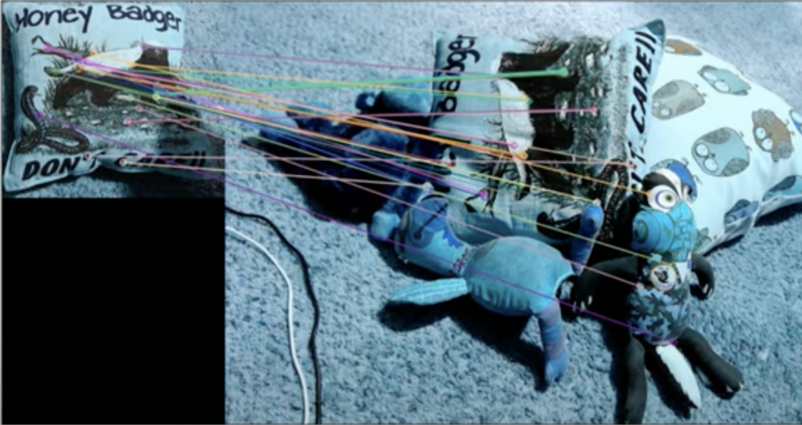

<head>
<!-- Global site tag (gtag.js) - Google Analytics -->

</head>

<h1 align="center">ברוכים הבאים לבלוג  
<b><u>
"Let's Build Together a Computer Vision and Image processing Library!"
</u></b></h1>

הבלוג מיועד:
<ul>
    <li>לאנשים וסטודנטים שמאוד אוהבים מתמטיקה ומאוד אוהבים קוד.</li>
    <li>לסטודנטים ואנשים שרוצים להיכנס לעולם הראייה הממוחשבת והעיבוד תמונה, לאנשים שרוצים להרחיב את הידע שלהם בצורה מעמיקה בנושא או לסטודנטים שרוצים לעשות לעצמם סדר בחומרים שהם לומדים בקורסים הרלוונטים באוניברסיטה. </li>
 </ul>

 
מטרת המדריך היא ללמד אותנו את התאוריה והאלגוריתמים מאחורי הקלעים מאחורי הפוקנציות של 
OpenCV, 
 את החולשות שלהם, איפה הם נופלים ואיך כדאי להשתמש בהן כדי להפיק את המיטב עבור הפרויקט שלנו. בפרט, נשתדל לשאוף כמה שיותר לממש אותן עם קוד אותנטי שלנו. 
 בפעולות כמו קריאת תמונות והצגתן, כן ניעזר בספרייה המוכנה כדי למקד אותנו במשימה עצמה שלפנינו בכל מדריך ומדריך.
 
 
ספרייה לעיבוד תמונה וראייה ממוחשבת אמורה לתת ביצועי 
Real-Time.
לכן, 
למען אותנטיות הקוד, ומכיוון שהקוד כולו יחד אמור בסופו של דבר לייצג ספריית ראייה ממוחשבת ועיבוד תמונה,
נשתמש ב
C++
ולא ב
Python.
 
בנוסף זו הזדמנות טובה לכל האנשים שנגעו בקצה התחום ועשו בעיקר פרויקטים עם 
OpenCV
בפייתון,
באמת להעמיק את ההבנה והידע בפונקציות הספרייה עצמה, והאובייקטים שעומדים מאחוריה.
 

<h1 align="center"><b>בהצלחה לנו!</b></h1>

 
 

