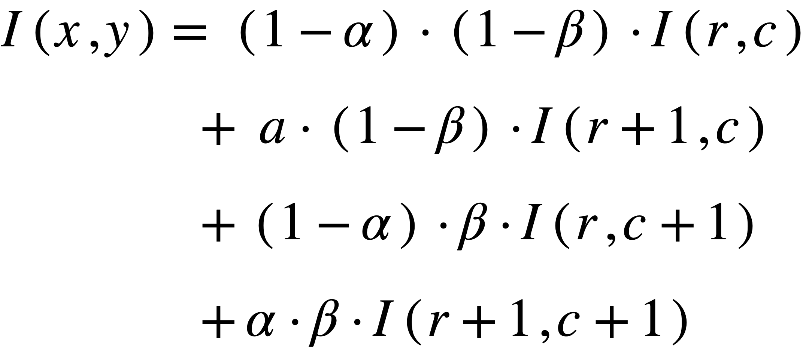

<head>
<!-- Global site tag (gtag.js) - Google Analytics -->

</head>

<h1>בעיית ״קיפולי התדר״ - The Spatial Aliasing Problem </h1>
<b><u>Spatial Aliasing</u></b>
- 
היא למעשה דגימה לא יעילה או מספקת של הנתונים לאורך הצירים.
 
 
נשמע לא מובן? מאמין לכם.
 
 
אנסה להסביר לכם בצורה פשוטה ומופשטת יותר, וממבט של מדען מחשב ולא מהנדס חשמל.
 
כאשר אנו מבצעים טרנספורמציה כלשהי באופן נאיבי על תמונה, אנו למעשה מחשבים לכל פיקסל בתמונת מקור שלנו, את מיקומו בתמונת היעד.
 
מכיוון שמרחב התמונה שלנו אינו רציף (אינו נע בקטע ממשי), אלא הוא מרחב בדיד (נע בין ערכים טבעיים שלמים במקרה שלנו) אז בביצוע הטרנספורמציה אנו עלולים לקבל ערכים שאינם שלמים.
  
<b><u>לדוגמה:</u></b>
הפעלת רוטציה בזווית 30 על הפיקסל
(5,3) 
תוביל אותנו אל הערכים
(2.83,5.09), 
אך מכיוון שהתמונה מיוצגת על ידי מטריצה שכל תא בה מיוצג על ידי ערכים טבעיים נאלץ לעגל את הערכים שקיבלנו.
 
כלומר בביצוע רוטציה לפיקסל
(5,3) 
בתמונת המקור שלנו 
ערכו (הצבע שלו) יעבור לפיקסל
(3,5) 
בתמונת היעד שלנו.
  
במילים אחרות, דגמנו עבור הפיקסל
(3,5)
<b> בתמונת היעד </b>
את ערכו של הפיקסל
(5,3)
<b> בתמונת המקור. </b>

<figure>
    
    <figcaption align="center"> 
    ביצוע דגימת הצבע מפיקסל
    (u,v)
    עבור הפיקסל 
    (round(x),round(y))
    כלומר עיגלנו את הערכים 
    (x,y)
    שקיבלנו מהטרנספורמציה.
     
    ממש כמו בדוגמה קודם, כאשר שהערכים שקיבלנו מהטרנספורמציה לפיקסל היעד היו (2.83,5.09)
    אך עיגלנו אותם למרכז הפיקסל הקרוב שערכיו הם
    (3,5).
      </figcaption>
</figure>
<h3><b><u>אז איפה למעשה קוראת בעיית הדגימה ולמה היא אינה מספקת אותנו ואינה יעילה?</u></b></h3> 
מכיוון שבכל חישוב לכל פיקסל יש צורך לעגל את התוצאה למרכזי הפיקסלים בתמונת היעד נקבל 2 תרחישים אינם רצויים:
<ol style="font-weight: bold;">
    <li>יהיו פיקסלים בתמונת היעד שלא ניתן להם דגימה מתמונת המקור ובפועל נקבל תמונה ״מחוררת״ בה יהיה חסר צבע לחלק מהפיקסלים</li>
    <li>יהיו פיקסלים שנדגום להם פעמיים צבע מתמונת המקור ולכן ערכים ידרסו אחד את השני עבור אותם הפיקסלים</li>
</ol>
<figure>
    
</figure>

דוגמה מוחשית לעניין ומימוש נאיבי תוכלו למצוא בתחילת
<a href="https://royamoyal.github.io/ComputerVision-ImageProcessing-Tutorial-Blog/Rotation.html"> המדריך לרוטציה של תמונות.</a>
 
התוצאה שקיבלנו שם:
 
<figure>
  
</figure>

<h1 align="center"><b><u> פתרון ה-Interpolation </u></b></h1>
אינטרפולציה היא שיטת ״הערכה״ בתחום האנליזה נומרית, שהרעיון המרכזי מאחוריה, היא למעשה למצוא נקודות מידע חדשות המבוססות על טווח של סט בדיד של נקודות ידועות.
 
 
 בשפה פשוטה יותר, נניח שיש לנו קבוצת נקודות ידועות על הצירים שהתקבלו ע״י פונקציה כלשהי, אך אין לנו את הפונקציה עצמה, אלא רק את הנקודות.
 למעשה באמצעות שיטת האינטרפולציה נוכל לנסות לשחזר בקירוב את הפונקציה, או לתת הערכה לנקודות אחרות שהיינו מקבלים על ידי הפונקציה ,רק על סמך הנקודות הידועות לנו.

<figure>
    
        <figcaption> 
        שחזור הפונקציה על סמך הנקודות האדומות הידועות לנו בשימוש בשיטה הנקראת ״אינטרפולציה לינארית״
        </figcaption>
</figure>

<h2><u><b>הגדרה לאינטרפולציה בעיבוד תמונה:</b></u></h2>
בעיבוד תמונה
זוהי טכניקה להקצות ערכים לפיקסלים בתמונות על בסיס 
הפיקסלים הסמוכים למיקום הדגימה שאינו בהכרח מותאם למיקומי התמונה התקינים.
  
 כלומר, ממש כמו ההסבר בתחילת העמוד כאן, אנחנו הולכים לבצע טרנספורמציה שאינה בהכרח תוביל אותנו ל״מרכז הפיקסל, ממנו אנחנו רוצים לבצע את הדגימה.
  

 
 איך אז זה עוזר לנו בעצם לפתור את בעיית הSpatial Aliasing?
  
 אנחנו למעשה הולכים לעבור פיקסל-פיקסל בתמונת היעד ולעשות את הטרנספורמציה ההופכית לטרנספורמציה המקורית שרצינו, וע״י כך למצוא את הדגימה הנכונה לאותו הפיקסל. למרות שלא ניפול במרכז פיקסל בתמונה המקורית, נחליט על ידי שיטות האינטרפולציה השונות כיצד לדגום את ערך הפיקסל שלנו על ידי המיקום שבו נפלנו בתמונה המקורית. 
  
<ol>
    <li>מכיוון שאנחנו עוברים פיקסל-פיקסל בתמונת היעד שלנו, אנחנו פותרים באופן טבעי את עניין התמונה המחוררת, כי אין מצב בו פספסנו דגימה עבור פיקסל. </li>
    <li>פתרנו גם את עניין הדגימה הכפולה עבור פיקסל בתמונת היעד, מכיוון שאנחנו דוגמים עבורו פעם אחת ויחידה את הצבע מהתמונה המקורית</li>
</ol>

<figure>
  
</figure>

   
 איך זה קורה בפועל?
 <b>
נפעל על פי האלגוריתם הבא:
</b>
 <ol>
    <li>נחשב את הטרנספורמציה ההפוכה לפעולה שאנחנו רוצים לבצע לתמונה.
        <ul>
        <li>לדוגמה: ברוטציה של תמונה, נחשב את הטרנספורמציה(או המטריצה) ההופכית למטריצת הרוטציה/סיבוב</li>
        </ul>
    </li>
    <li>נעבור על כל הפיקסלים 
        <b>בתמונת היעד </b>
        שלנו ונחשב ע״י הטרנספורמציה ההפוכה את ״מיקום״ הדגימה של הפיקסלים הרלוונטים 
        <b>מתמונת המקור שלנו</b>
        (שימו לב שזו פעולה הפוכה לגמרי לפעולה הנאיבית שעשינו קודם)
    </li>
    <li>עבור כל מיקום בתמונת המקור שקיבלנו מהטרנספורמציה ההפוכה עבור פיקסל מסויים מתמונת היעד, נבחר באחת משלוש השיטות הבאות את הפיקסלים עבור הדגימה:
        <ul>
            <li>אינטרפולציה לשכן הקרוב ביותר
            (Nearest Neighbor Interpolation)</li>
            <li>אינטרפולציה לינארית (Bi-Linear Interpolation)</li>
            <li>אינטרפולציה קובייתית (Bi-Cubic Interpolation)</li>
        </ul>
    </li>
</ol>
    

<h3><u><b>אינטרפולציה לשכן הקרוב ביותר
            (Nearest Neighbor Interpolation)</b></u></h3>
השיטה הזאת היא הקלה ביותר, והיא מניבה תוצאה לא רעה (אך לא הכי איכותית).
לכל פיקסל בתמונת היעד, כאשר נפעיל עבורו את הטרנספורמציה ההפוכה לתמונת המקור, נבחר לקחת דגימה מהפיקסל שהכי קרוב לערכים בהם ״נפלנו״. (נבצע עיגול לערכים)
 
כלומר אם נפלנו בערכים 
(7.49,8.67) 
נבחר לקחת את ערך הפיקסל 
(7,9).

<figure>
  
</figure>



void NearestNeighbor_Interpolation_Helper(const cv::Mat& src, cv::Mat& dst, const cv::Point2d& srcPoint, cv::Point2i& dstPixel)
{
    // Find Nearest Neighbor
    int NearestNeighborX = (int) round(srcPoint.x);
    int NearestNeighborY = (int) round(srcPoint.y);
    cv::Point2i NearestNeighborPixel(NearestNeighborX,NearestNeighborY);
    if (src.channels() > 1)
    { //RGB image
        if (NearestNeighborPixel.x < 0 || NearestNeighborPixel.x > src.cols - 1 || NearestNeighborPixel.y < 0 || NearestNeighborPixel.y > src.rows - 1)
            dst.at<cv::Vec3b>(dstPixel) = 0;
        else
            dst.at<cv::Vec3b>(dstPixel) = src.at<cv::Vec3b>(NearestNeighborPixel);
    }
    else// GrayScale Image
    {
        if (NearestNeighborPixel.x < 0 || NearestNeighborPixel.x > src.cols - 1 || NearestNeighborPixel.y < 0 || NearestNeighborPixel.y > src.rows - 1)
            dst.at<uchar>(dstPixel) = 0;
        else
            dst.at<uchar>(dstPixel) = src.at<uchar>(NearestNeighborPixel);
    }
}


 
הסבר לקוד:


void NearestNeighbor_Interpolation_Helper(const cv::Mat& src, cv::Mat& dst, const cv::Point2d& srcPoint, const cv::Point2i& dstPixel)


 

הפונקציה שלנו תקבלת את:
<ol>
    <li>const cv::Mat& src - תמונת המקור ממנה נבצע את המקור </li>
    <li>cv::Mat& dst - תמונת היעד, שבא תאוחסן התוצאה </li>
    <li>const cv::Point2d& srcPoint - נקודת ״הנפילה״ מהטרנספורמציה ההפוכה שלה שממנה נבחר את הפיקסל הקרוב ביותר לביצוע הדגימה</li>
    <li>const cv::Point2i& dstPixel - הפיקסל ממנו ביצענו את הטרנספורמציה ההופכה, ולכן הוא יקבלל את ערך הדגימה</li>
</ol>
 


int NearestNeighborX = (int) round(srcPoint.x);
int NearestNeighborY = (int) round(srcPoint.y);
cv::Point2i NearestNeighborPixel(NearestNeighborX,NearestNeighborY);


 
נעגל את נקודת הנפילה, לפיקסל הקרוב ביותר (לו נקרא ״השכן הקרוב ביותר).



 if (src.channels() > 1)
    { //RGB image
        if (NearestNeighborPixel.x < 0 || NearestNeighborPixel.x > src.cols - 1 || NearestNeighborPixel.y < 0 || NearestNeighborPixel.y > src.rows - 1)
            dst.at<cv::Vec3b>(dstPixel) = 0;
        else
            dst.at<cv::Vec3b>(dstPixel) = src.at<cv::Vec3b>(NearestNeighborPixel);
    }
    else// GrayScale Image
    {
        if (NearestNeighborPixel.x < 0 || NearestNeighborPixel.x > src.cols - 1 || NearestNeighborPixel.y < 0 || NearestNeighborPixel.y > src.rows - 1)
            dst.at<uchar>(dstPixel) = 0;
        else
            dst.at<uchar>(dstPixel) = src.at<uchar>(NearestNeighborPixel);
    }


 
לבסוף נבדוק 2 דברים רגע לפני ההשמה: (לא אחזור על ההסבר בשיטות הבאות)
<ul>
    <li>אם התמונה היא 
        Grayscale
        כל פיקסל מכיל ערך אחד ויחיד ולכן נשתמש ב
        uchar.
        אחרת, כל פיקסל מכיל וקטור שבו יש שלושה ערכים, אדום,ירוק וכחול (או בסדר אחר) ולכן יש נשתמש בוקטור בעל 3 ערכים, 
        Vec3b.
     </li>
    <li>אם ערכי הפיקסל של השכן הקרוב ביןתר חצו את גבולות התמונה, נסיק כי הפיקסל בתמונת היעד צריך לקבל את הערך שחור מכיוון שהדגימה שלו אינה נמצאת בגבולות התמונה. (אחרת נבצע השמה במעגלים שתשבש לנו את התוצאה הרצוייה)
    </li>
</ul>

<h3><u><b>אינטרפולציה לינארית
            (Bi-Linear Interpolation)</b></u></h3>
בשיטה הזאת נקבל תוצאה איכותית יותר מאינטרפולצית השכן הקרוב ביותר.
 
למעשה, בשיטה זו נקח את ה-4 שכנים הקרובים ביותר לפיקסל וניקח מכל אחד מהם דגימה יחסית, לפי המרחק שלהם מ״נקודת הנפילה״ מהטרנספורמציה ההפוכה.
 
 
נרצה לתת פיקסל הקרוב יותר לנקודת הנחיתה (מ-4 השכנים), את המרחק הגדול יותר כיחס הצבע שנקח ממנו (״האחוז" בשבר מהערך שנקח ממנו״), כלומר לא המרחק ממנו אל נקודת הנחיתה, אלא את המרחק מהפיקסל המקביל עליו בציר ה-
x 
(אם מחשבים לפי ציר ה-x)
או את המרחק מהשכן המקביל אליו בציר ה
y.
(אם מחשבים לפי ציר ה-y)
מנקודת הנחיתה.
 
לכל שכן, נכפיל את מקדמי היחס בהתאם לחישוב ולמעשה כך ״יושלם״ היחס ל-1 גם בציר ה-x וגם בציר ה-y.
 
 
<figure>
 
 <figcaption align="center"> 
בדרך כלל נהוג לקחת את השכן השמאלי העליון כ״רצפת״ הערכים של נקודת ״הנפילה״/נחיתה, ואז את השלושה השכנים האחרים בהתאמה.
</figcaption>
</figure>
 
<b><u>הנוסחה:</u></b>
<figure>
  
</figure>
<b><u>כלומר נקבל:</u></b>
<figure>
  
</figure>

<b><u>הקוד בהתאם לנוסחה עבור 
GrayScale:</u></b>



void Linear_Interpolation_GRAYHelper(const cv::Mat& src, cv::Mat& dst, const cv::Point2d& srcPoint, cv::Point2i& dstPixel)
{
    // Lets find the 4-Nearest Neighbors of our "landing" spot.
    // (r,c),(r,c+1),(r+1,c),(r+1,c+1)
    int leftUpperNeighborX = floor(srcPoint.x);
    int leftUpperNeighborY = floor(srcPoint.y);
    // (r,c)
    cv::Point2i leftUpperNeighbor(leftUpperNeighborX, leftUpperNeighborY);
    // (r,c+1)
    cv::Point2i leftBottomNeighbor(leftUpperNeighborX, leftUpperNeighborY + 1);
    // (r+1,c)
    cv::Point2i rightUpperNeighbor(leftUpperNeighborX + 1, leftUpperNeighborY);
    // (r+1,c+1)
    cv::Point2i rightBottomNeighbor(leftUpperNeighborX + 1, leftUpperNeighborY + 1);

    // ratioX = Alpha , ratioY = Beta
    // 0 <= ratioX,ratioY <= 1
    double Alpha = srcPoint.x - (double) leftUpperNeighborX;
    double Beta = srcPoint.y - (double) leftUpperNeighborY;

    if (leftUpperNeighbor.x < 0 || leftUpperNeighbor.x > src.cols - 1 || leftUpperNeighbor.y < 0 || leftUpperNeighbor.y > src.rows - 1)
        dst.at<uchar>(dstPixel) = 0;
    else {

        int greyValue = int((1 - Alpha) * (1 - Beta) * src.at<uchar>(leftUpperNeighbor) +
                            (Alpha) * (1 - Beta) * src.at<uchar>(rightUpperNeighbor) +
                            (1 - Alpha) * (Beta) * src.at<uchar>(leftBottomNeighbor) +
                            Alpha * Beta * src.at<uchar>(rightBottomNeighbor));

        dst.at<uchar>(dstPixel) = greyValue;

    }
}


 
<b><u>הקוד בהתאם לנוסחה עבור 
תמונות עם צבע (3 channels):</u></b>
 
ללא ספק ניתן לבצע את הקוד בצורה יעילה יותר ע״י פונקציה שתעשה לנו את החישוב עצמו במקום חזרה על החישוב לכל צבע, אך רק לשם המחשה נשאיר כעת את הקוד כך.


void Linear_Interpolation_3Channels(const cv::Mat& src, cv::Mat& dst, const cv::Point2d& srcPoint, cv::Point2i& dstPixel)
{

    // Lets find the 4-Nearest Neighbors of our "landing" spot.
    // (r,c),(r,c+1),(r+1,c),(r+1,c+1)
    int leftUpperNeighborX = floor(srcPoint.x);
    int leftUpperNeighborY = floor(srcPoint.y);
    // (r,c)
    cv::Point2i leftUpperNeighbor(leftUpperNeighborX, leftUpperNeighborY);
    // (r,c+1)
    cv::Point2i leftBottomNeighbor(leftUpperNeighborX, leftUpperNeighborY + 1);
    // (r+1,c)
    cv::Point2i rightUpperNeighbor(leftUpperNeighborX + 1, leftUpperNeighborY);
    // (r+1,c+1)
    cv::Point2i rightBottomNeighbor(leftUpperNeighborX + 1, leftUpperNeighborY + 1);

    // ratioX = Alpha , ratioY = Beta
    // 0 <= ratioX,ratioY <= 1
    double Alpha = srcPoint.x - (double) leftUpperNeighborX;
    double Beta = srcPoint.y - (double) leftUpperNeighborY;

    if (leftUpperNeighbor.x < 0 || leftUpperNeighbor.x >= src.cols - 1 || leftUpperNeighbor.y < 0 || leftUpperNeighbor.y >= src.rows - 1)
        dst.at<cv::Vec3b>(dstPixel) = 0;  // ratio with the left upper neighbor
    else {
        int B = int((1 - Alpha) * (1 - Beta) * src.at<cv::Vec3b>(leftUpperNeighbor)[0] +
                    (1 - Alpha) * (Beta) * src.at<cv::Vec3b>(rightUpperNeighbor)[0] +
                    (Alpha) * (1 - Beta) * src.at<cv::Vec3b>(leftBottomNeighbor)[0] +
                    (Alpha) * (Beta) * src.at<cv::Vec3b>(rightBottomNeighbor)[0]);

        int G = int((1 - Alpha) * (1 - Beta) * src.at<cv::Vec3b>(leftUpperNeighbor)[1] +
                    (1 - Alpha) * (Beta) * src.at<cv::Vec3b>(rightUpperNeighbor)[1] +
                    (Alpha) * (1 - Beta) * src.at<cv::Vec3b>(leftBottomNeighbor)[1] +
                    (Alpha) * (Beta) * src.at<cv::Vec3b>(rightBottomNeighbor)[1]);

        int R = int((1 - Alpha) * (1 - Beta) * src.at<cv::Vec3b>(leftUpperNeighbor)[2] +
                    (1 - Alpha) * (Beta) * src.at<cv::Vec3b>(rightUpperNeighbor)[2] +
                    (Alpha) * (1 - Beta) * src.at<cv::Vec3b>(leftBottomNeighbor)[2] +
                    (Alpha) * (Beta) * src.at<cv::Vec3b>(rightBottomNeighbor)[2]);

        cv::Vec3b newVal(B, G, R);
        dst.at<cv::Vec3b>(dstPixel) = newVal;
    }
}


 

<h3><u><b>אינטרפולציה קובייתית (Bi-Cubic Interpolation)</b></u></h3>
בניגוד לאינטרפולציות הקודמות, אינטרפולציה קובייתית, היא האינטרפולציה האיכותית ביותר שאפילו לדברי המומחים, משתמשים בה כמעט תמיד ב
-Photoshop
 כאשר מבצעים טרנספורמציות על תמונות בתוכנה. 
 
 
בשיטה זו נקח למעשה את 16 השכנים הקרובים ביותר, ל״נקודת הנחיתה״ שבה נפלנו מהטרנספורמציה ההפוכה.
 
למרות שזה נשמע מאוד ישיר, בניגוד לאינטרפולציה הלינארית בה לקחנו את השכן השמאלי העליון כרצפת הערכים (בצורה שרירותית) ואז בחרנו בהתאמה את האחרים, כאן 16 השכנים נבחרים בחוכמה יותר.
 
 
נבהיר את אופן הבחירה על פי הדוגמה הבאה:
 
נחלק את הפיקסל הקרוב ביותר לנקודת הנחיתה ל4 רביעים.
(חשוב להבהיר כי בכל רביע שניפול בפיקסל עיגול הערכים יתנו את מרכז אותו הפיקסל).
לאחר מכן בהתאם לרביע שניפול, נבחר את 16 השכנים בהתאמה. 
<figure>

 <figcaption align="center"> 
 <ul>
    <li>
אם ניפול ברביע השמאלי העליון (הרביע הירוק) נבחר את 16 השכנים השמאליים העליונים כמו בציור. 
    </li>
    <li>
אם ניפול ברביע הימני התחתון (הרביע הצהוב) נבחר את 16 
השכנים הימניים התחתונים.  
    </li>
    <li>
עם אותה לוגיקה, נבחר את 16 השכנים בהתאמה אם ניפול באחד מהרביעים האדומים.
    </li>
    </ul>
 </figcaption> 
</figure>
 
לאחר שנבחר את 16 השכנים, כמו באינטרפולציה הלינארית ניתן לכל שכן את היחס שמערכו לפי ציר ה
-x
ולפי ציר 
ה-y.
 
לאחר שחקרתי רבות וניסיתי להבין את פיתוח הנוסחה, מצאתי את המאמר שפרסם את הנוסחה ב-1984. השיטה כל כך טובה אפילו שהמצלמה הדיגטלית התפתחה רבות מאז, 
<a href="http://www.ncorr.com/download/publications/keysbicubic.pdf">.למאמר עצמו</a>

 
 
למעשה האינטרפולציה הזאת מתנהגת מאוד דומה להתפלגות גאוסיינית ולכן יורשת את רוב התכונות שלה. היא יעילה, חכמה ונותנת תוצאות מעולות. 
 
<b>למעשה החסרון העיקרי של האינטרפולציה הקובייתית</b> 
היא שזמן החישוב לוקח המון זמן. לתמונה מאוד גדולה, החישוב עלול לקחת למעל לחצי דקה (ניתן לשפר את הביצועים עם תכנות חכם אך עדיין השיטה תהיה איטית)! לכן השיטה אינה מתאימה לביצועי
Real-Time 
ובדר״כ משתמשים באינטרפולצייה לינארית שנותנת תוצאות מספקות בזמן הדרוש. 
 
להרחבה על הקשר בין האינטרפולציה להתפלגות גאוסיינית אתם מוזמנים לקרוא 
.במאמר הבא
<a href="https://www.researchgate.net/publication/3192900_Scale-space_derived_from_B-splines
">במאמר הבא</a>.
 
<figure>

</figure>

 
<b><u>הנוסחה:</u></b>
<figure>

</figure>
 
 קירוב טוב לנוסחה ללא צורך בפתירת מערכת המשוואות הוא הצבה של
a = 0.5 
.
 
<b><u>כלומר נקבל ב-Ca:</u></b>

<figure>

</figure>
 
הנוסחה הישירה בקוד:


double cubicEquationSolver(double d,double a) {
    d = std::fabs(d);
    if( 0.0 <= d  && d <= 1.0) {
        double score = (a + 2.0) * pow(d, 3.0) - ((a + 3.0) * pow(d, 2.0)) + 1.0;
        return score;
    }
    else if(1 < d && d <= 2) {
        double score = a * pow(d, 3.0) - 5.0*a * pow(d, 2.0) + 8.0*a * d - 4.0*a;
        return score;
    }
    else
        return 0.0;
}


 

פונקציית האינטרפולציה שלנו (כאשר מציבים את הקירוב של המינוס חצי):


void Cubic_Interpolation_Helper(const cv::Mat& src, cv::Mat& dst, const cv::Point2d& srcPoint, const cv::Point2i& dstPixel) {
    double newX = srcPoint.x;
    double newY = srcPoint.y;
    double dx = std::fabs(newX - round(newX));
    double dy = std::fabs(newY - round(newY));

    double sumCubicBValue = 0;
    double sumCubicGValue = 0;
    double sumCubicRValue = 0;
    double sumCubicGrayValue = 0;
    double uX;
    double uY;

    // if we are on the left quartets of the pixel, we want to move to the left pixel for taking the 16 neighbors, 2 columns before the original "round(newX)".
    // that because in the formula of the cubic, we only going back only one column using the indexes -1 to 2.

    if (floor(newX) - 1  < 0 || floor(newX) + 2  > src.cols - 1 || floor(newY) < 0 || floor(newY)  > src.rows - 1) {
        if (dst.channels() > 1)
            dst.at<cv::Vec3b>(dstPixel) = cv::Vec3b(0, 0,0);
        else
            dst.at<uchar>(dstPixel) = 0;
    }
    else {
        for (int cNeighbor = -1; cNeighbor <= 2; cNeighbor++) {
            for (int rNeighbor = -1; rNeighbor <= 2; rNeighbor++) {
                uX = cubicEquationSolver(rNeighbor + dx, -0.5);
                uY = cubicEquationSolver(cNeighbor + dy, -0.5);
                if (src.channels() > 1) {
                    sumCubicBValue = sumCubicBValue + (double) src.at<cv::Vec3b>(
                            cv::Point2i(round(newX) + rNeighbor, cNeighbor + round(newY)))[0] * uX * uY;
                    sumCubicGValue = sumCubicGValue + (double) src.at<cv::Vec3b>(
                            cv::Point2i(round(newX) + rNeighbor, cNeighbor + round(newY)))[1] * uX * uY;
                    sumCubicRValue = sumCubicRValue + (double) src.at<cv::Vec3b>(
                            cv::Point2i(round(newX) + rNeighbor, cNeighbor + round(newY)))[2] * uX * uY;
                } else {
                    sumCubicGrayValue = sumCubicGrayValue + (double) src.at<uchar>(
                            cv::Point2i(round(newX) + rNeighbor, cNeighbor + round(newY))) * uX * uY;
                }
            }
        }

        if (originalImage.channels() > 1) {
            if(sumCubicRValue>255)
                sumCubicRValue = 255;
            else if(sumCubicRValue < 0)
                sumCubicRValue = 0;

            if(sumCubicGValue>255)
                sumCubicGValue = 255;
            else if(sumCubicGValue < 0)
                sumCubicGValue = 0;

            if(sumCubicBValue>255)
                sumCubicBValue = 255;
            else if(sumCubicBValue < 0)
                sumCubicBValue = 0;

            outPutImageCubic.at<cv::Vec3b>(cv::Point2i(x, y)) = cv::Vec3b((int) sumCubicBValue,
                                                                          (int)sumCubicGValue,
                                                                          (int) sumCubicRValue);
    }
        else {
            if(sumCubicGrayValue>255)
                sumCubicGrayValue = 255;
            else if(sumCubicGrayValue < 0)
                sumCubicGrayValue = 0;
            outPutImageCubic.at<uchar>(cv::Point2i(x,y)) = sumCubicGrayValue;
        }
    }
}


 
 
<b><u> הסבר קצת לחלק האחרון בקוד: </u></b>
<button id="InterpolationCubButton" class="button" onclick="myFunction()">הראה קוד</button>


 if (originalImage.channels() > 1) {
            if(sumCubicRValue>255)
                sumCubicRValue = 255;
            else if(sumCubicRValue < 0)
                sumCubicRValue = 0;

            if(sumCubicGValue>255)
                sumCubicGValue = 255;
            else if(sumCubicGValue < 0)
                sumCubicGValue = 0;

            if(sumCubicBValue>255)
                sumCubicBValue = 255;
            else if(sumCubicBValue < 0)
                sumCubicBValue = 0;

            outPutImageCubic.at<cv::Vec3b>(cv::Point2i(x, y)) = cv::Vec3b((int) sumCubicBValue,
                                                                          (int)sumCubicGValue,
                                                                          (int) sumCubicRValue);
    }
        else {
            if(sumCubicGrayValue>255)
                sumCubicGrayValue = 255;
            else if(sumCubicGrayValue < 0)
                sumCubicGrayValue = 0;
            outPutImageCubic.at<uchar>(cv::Point2i(x,y)) = sumCubicGrayValue;
        }
    }


 

 

 
למעשה מכיוון שאנחנו משתמשים בקירוב ע״י הצבת 
a = -0.5 
אנו עלולים לקבל ערכי 
underflow ו
overflow בפיקסלים. 
לכן קיימים התיקונים בסוף הפונקציה שמתקנים את החריגות בהתאמה. 
 
אתם מוזמנים לנסות להריץ את הקוד ללא הטיפול בחריגות ותקבלו תוצאות טובות, אבל כמה פיקסלים בצבעים אחרים כמו טורקיז שאינם נכונים עבור התמונה.
 
 

כל הכבוד אם הגעתם עד לכאן, סיימתם את המדריך לאינטרפולציה ואתם מוכנים למדריכים הבאים! 

   

